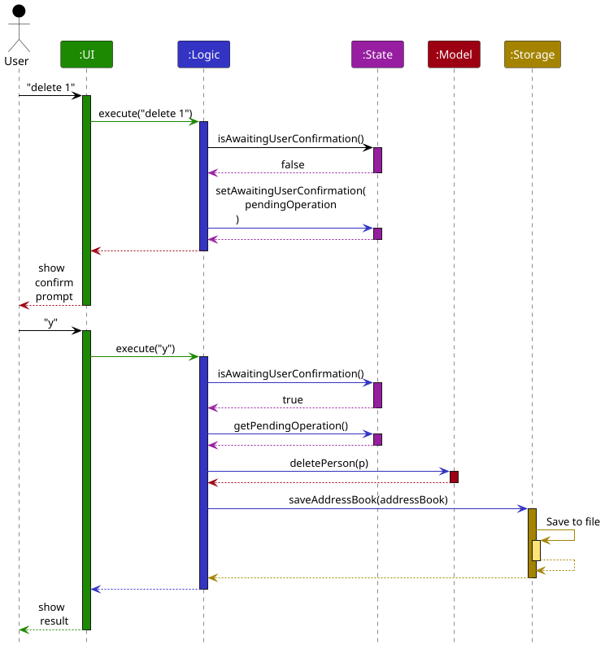
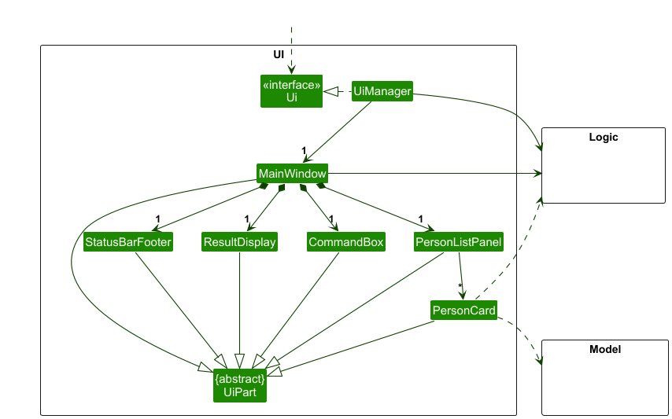
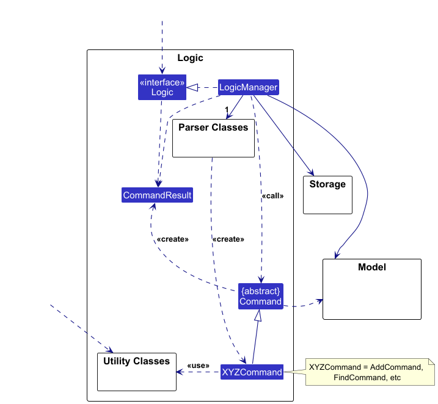
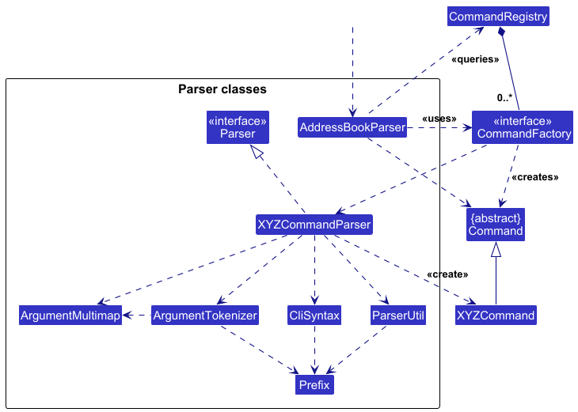
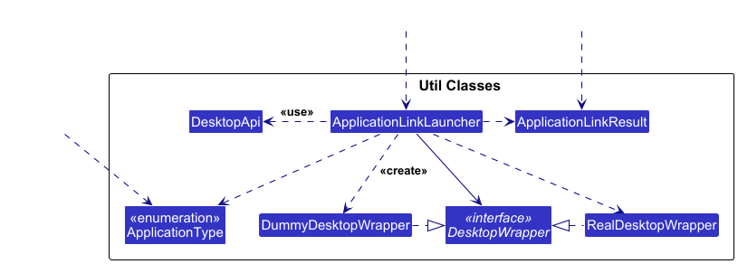
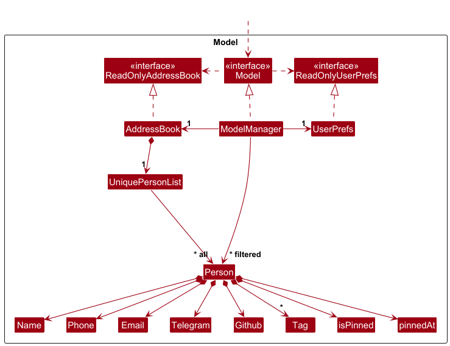
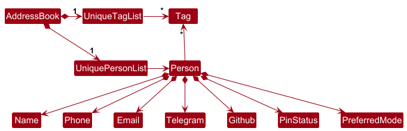

* Table of Contents
{:toc}

--------------------------------------------------------------------------------------------------------------------

## **Acknowledgements**
Third party Libraries Used:
* [JavaFX](https://openjfx.io/)
* [Jackson](https://github.com/FasterXML/jackson)
* [JUnit5](https://github.com/junit-team/junit5)
* [TestFX](https://github.com/TestFX/TestFX)
* [Hamcrest](https://github.com/hamcrest/JavaHamcrest)
* [Mockito](https://github.com/mockito/mockito)

Credits Adapted ideas:
* [Cross Platform Launching](https://stackoverflow.com/questions/18004150/desktop-api-is-not-supported-on-the-current-platform)
    * Note: JavaDoc Headers were not provided by the original credited author, but by the developer ([MoshiMoshiMochi](https://github.com/MoshiMoshiMochi)) implementing this. Hence, these documentations may not be exactly what the original author envisioned.

--------------------------------------------------------------------------------------------------------------------

## **Setting up, getting started**

Refer to the guide [_Setting up and getting started_](SettingUp.md).

--------------------------------------------------------------------------------------------------------------------

## **Design**

<div markdown="span" class="alert alert-primary">

:bulb: **Tip:** The `.puml` files used to create diagrams are in this document `docs/diagrams` folder. Refer to the [_PlantUML Tutorial_ at se-edu/guides](https://se-education.org/guides/tutorials/plantUml.html) to learn how to create and edit diagrams.
</div>

### Architecture


The ***Architecture Diagram*** given above explains the high-level design of the App.

Given below is a quick overview of main components and how they interact with each other.

**Main components of the architecture**

**`Main`** (consisting of classes [`Main`](https://github.com/AY2526S1-CS2103-F12-2/tp/blob/master/src/main/java/seedu/address/Main.java) and [`MainApp`](https://github.com/AY2526S1-CS2103-F12-2/tp/blob/master/src/main/java/seedu/address/MainApp.java) is in charge of the app launch and shut down.
* At app launch, it initializes the other components in the correct sequence, and connects them up with each other.
* At shut down, it shuts down the other components and invokes cleanup methods where necessary.

The bulk of the app's work is done by the following four components:

* [**`UI`**](#ui-component): The UI of the App.
* [**`Logic`**](#logic-component): The command executor.
* [**`Model`**](#model-component): Holds the data of the App in memory.
* [**`Storage`**](#storage-component): Reads data from, and writes data to, the hard disk.

[**`Commons`**](#common-classes) represents a collection of classes used by multiple other components.

**How the architecture components interact with each other**

The *Sequence Diagram* below shows how the components interact with each other for the scenario where the user issues the command `delete 1`.



Each of the four main components (also shown in the diagram above),

* defines its *API* in an `interface` with the same name as the Component.
* implements its functionality using a concrete `{Component Name}Manager` class (which follows the corresponding API `interface` mentioned in the previous point.

For example, the `Logic` component defines its API in the `Logic.java` interface and implements its functionality using the `LogicManager.java` class which follows the `Logic` interface. Other components interact with a given component through its interface rather than the concrete class (reason: to prevent outside component's being coupled to the implementation of a component), as illustrated in the (partial) class diagram below.


The sections below give more details of each component.

### UI component

The **API** of this component is specified in [`Ui.java`](https://github.com/AY2526S1-CS2103-F12-2/tp/blob/master/src/main/java/seedu/address/ui/Ui.java)



The UI consists of a `MainWindow` that is made up of parts e.g.`CommandBox`, `ResultDisplay`, `PersonListPanel`, `StatusBarFooter` etc. All these, including the `MainWindow`, inherit from the abstract `UiPart` class which captures the commonalities between classes that represent parts of the visible GUI.

The `UI` component uses the JavaFx UI framework. The layout of these UI parts are defined in matching `.fxml` files that are in the `src/main/resources/view` folder. For example, the layout of the [`MainWindow`](https://github.com/AY2526S1-CS2103-F12-2/tp/blob/master/src/main/java/seedu/address/ui/MainWindow.java) is specified in [`MainWindow.fxml`](https://github.com/AY2526S1-CS2103-F12-2/tp/blob/master/src/main/resources/view/MainWindow.fxml)

The `UI` component,

* executes user commands using the `Logic` component.
* listens for changes to `Model` data so that the UI can be updated with the modified data.
* keeps a reference to the `Logic` component, because the `UI` relies on the `Logic` to execute commands.
* depends on some classes in the `Logic` component, because launching communication mode application through `UI` relies on `ApplicationLinkLauncher` to execute action.
* depends on some classes in the `Model` component, as it displays `Person` object residing in the `Model`.
* depends on the `Autocompletor` in `Logic` to provide suggestions while the user is typing.
* Keeps a reference to a `ReadOnlyCommandHistory` for use in accessing command history in the `CommandBox`

### Logic component

**API** : [`Logic.java`](https://github.com/AY2526S1-CS2103-F12-2/tp/blob/master/src/main/java/seedu/address/logic/Logic.java)

Here's a (partial) class diagram of the `Logic` component:



The sequence diagram below illustrates the typical interactions within the `Logic` component, taking `execute("edit 1 n/Adam")` API call as an example.


<div markdown="span" class="alert alert-info">:information_source: **Note:** The lifeline for `EditCommandParser` and `EditCommand` should end at the destroy marker (X) but due to a limitation of PlantUML, the lifeline continues till the end of diagram.
</div>


How the `Logic` component works in a typical case:
1. When `Logic` is called upon to execute a command, it is passed to an `AddressBookParser` object.
1. The `AddressBookParser` calls upon the `CommandRegistry` to obtain a `CommandFactory` that creates a Command.
1. The `AddressBookParser` supplies the parsed arguments to the `CommandFactory`, which in turn uses the `EditParser`.
1. This results in a `Command` object (more precisely, an object of one of its subclasses e.g., `EditCommand`) which is executed by the `LogicManager`.
1. The command can communicate with the `Model` when it is executed (e.g. to edit a person).<br>
   Note that although this is shown as a single step in the diagram above (for simplicity), in the code it can take several interactions (between the command object and the `Model`) to achieve.
1. The result of the command execution is encapsulated as a `CommandResult` object which is returned back from `Logic`.

#### State Management
The `Logic` component additionally relies on `State` to chiefly manage Confirmation prompts for some commands. In these cases, the components interact like so:


<div markdown="span" class="alert alert-info">:information_source: **Note:** `DeleteCommand` and `ConfirmCommand` are both created in the respective `ref` frames directly above them. PlantUML does not allow for the object to be created in the frame.

</div>

How Logic manages State:

* Before parsing a Command, LogicManager checks its `State` to see if there is an operation pending confirmation.
* If there is no pending operation, the Logic Manager parses the input as per normal.
* If there is a pending operation, `LogicManager` calls upon `AddressBookParser` to strictly parse the input as a `ConfirmCommand`. `ConfirmCommand` will clear `State` via a callback once satisfied.
* After execution of a command, if the command returns a `ConfirmationPendingResult`, the LogicManager sets the `State` to await for the user's confirmation

#### Parsing
Here are the other classes in `Logic` (omitted from the class diagram above) that are used for parsing a user command:



How the parsing works:
* When called upon to parse a user command, the `AddressBookParser` class queries `CommandRegistry` to find the appropriate `CommandFactory` instance that creates the corresponding `XYZCommandParser` class. (`XYZ`is a placeholder for the specific command name e.g., `AddCommandParser`) Once found, the `CommandFactory` instance creates the `XYZCommandParser` class which uses the other classes shown above to parse the user command and create a `XYZCommand` object (e.g., `AddCommand`) which the `AddressBookParser` returns back as a `Command` object.

* All `XYZCommandParser` classes (e.g., `AddCommandParser`, `DeleteCommandParser`, ...) inherit from the `Parser` interface so that they can be treated similarly where possible e.g, during testing.

#### Utility Classes



How the utility classes work:
* Currently utility classes are only used by `PersonCard`, `LaunchCommand`, `LaunchCommandParser` and `MainWindow`
* `LaunchCommandParser` uses on `ApplicationType` to decide how it creates `LaunchCommand`
* When called upon by either `LaunchCommand` or `PersonCard`, `ApplicationLinkLauncher` uses the `ApplicationType` and attempts to launch the communication mode through the use `DesktopApi`.
* Based on the success of the `DesktopApi` launch attempt, `ApplicationLinkLauncher` will return with create and return the appropriate  `ApplicationLinkResult`.

#### How the Components work together (Find Command)

The sequence diagram below shows the full execution of the `FindCommand` in the `Logic` component.


### Model component
**API** : [`Model.java`](https://github.com/AY2526S1-CS2103-F12-2/tp/blob/master/src/main/java/seedu/address/model/Model.java)




The `Model` component,

* stores the address book data i.e., all `Person` objects (which are contained in a `UniquePersonList` object).
* stores the currently 'selected' `Person` objects (e.g., results of a search query) as a separate _filtered and sorted_ list which is exposed to outsiders as an unmodifiable `ObservableList<Person>` that can be 'observed' e.g. the UI can be bound to this list so that the UI automatically updates when the data in the list change.
* stores a `UserPref` object that represents the user’s preferences. This is exposed to the outside as a `ReadOnlyUserPref` objects.
* does not depend on any of the other three components (as the `Model` represents data entities of the domain, they should make sense on their own without depending on other components)

<div markdown="span" class="alert alert-info">:information_source: **Note:** An alternative (arguably, a more OOP) model is given below. It has a `Tag` list in the `AddressBook`, which `Person` references. This allows `AddressBook` to only require one `Tag` object per unique tag, instead of each `Person` needing their own `Tag` objects.<br>



</div>


### Storage component

**API** : [`Storage.java`](https://github.com/AY2526S1-CS2103-F12-2/tp/blob/master/src/main/java/seedu/address/storage/Storage.java)


The `Storage` component,
* can save both address book data and user preference data in JSON format, and read them back into corresponding objects.
* inherits from both `AddressBookStorage` and `UserPrefStorage`, which means it can be treated as either one (if only the functionality of only one is needed).
* depends on some classes in the `Model` component (because the `Storage` component's job is to save/retrieve objects that belong to the `Model`)

### Common classes

Classes used by multiple components are in the `seedu.address.commons` package.

--------------------------------------------------------------------------------------------------------------------

## **Implementation**

This section describes some noteworthy details on how certain features are implemented.

### Pin/unpin feature

#### Overview

The Pin and Unpin feature allows users to prioritize important contacts by pinning them to the top of the contact list.
Pinned contacts remain visible at the top regardless of the current sort order (e.g., by name or by recency).
This feature enhances usability by making key contacts more accessible.

#### Rationale

In a large address book, users may need to frequently access certain contacts.
Instead of repeatedly searching for them, the pin feature provides a simple way to mark and elevate these contacts for quick access.
The unpin command restores a contact to its normal position in the list.

#### Design Considerations
- **Pinning Behavior**: When a contact is pinned, it should appear above all unpinned contacts in the displayed list.
- **Unpinning Behavior**: When a contact is unpinned, it returns to its original position relative to other unpinned contacts, based on the current sorting method.
- **Multiple Pins**: If multiple contacts are pinned, they are ordered among themselves based on their pin time (most recent first).
- **Persistence**: The pinned state (`isPinned` and `pinnedAt`) is stored in the address book data file so that it is retained across sessions.
- **Sorting Integration**: The feature is compatible with existing sorting options (e.g., name sort or recency sort). When the user applies any sort, the pin order is reapplied afterward to maintain consistency.

#### Implementation Details
- Each contact has an additional field indicating whether it is pinned, along with a timestamp representing when it was pinned.
- When the list is displayed, a sorting mechanism ensures that all pinned contacts are moved to the top, preserving the order of all other entries.
- The pin and unpin commands update the relevant contact and trigger a list refresh to reflect the new state immediately.
- The UI displays a visual indicator (such as a pin icon) beside pinned contacts to distinguish them clearly from unpinned ones.

#### Example Scenarios
1. **User pins a contact**: The contact immediately appears at the top of the list, along with other pinned contacts.
2. **User unpins a contact**: The contact moves back to its regular position according to the active sort order.
3. **User applies a name sort**: Contacts are sorted alphabetically, but pinned contacts remain above the rest.
4. **User exits and restarts the application**: Previously pinned contacts remain pinned as their state is saved in storage.


### \[Proposed\] Undo/redo feature

#### Proposed Implementation

The proposed undo/redo mechanism is facilitated by `VersionedAddressBook`. It extends `AddressBook` with an undo/redo history, stored internally as an `addressBookStateList` and `currentStatePointer`. Additionally, it implements the following operations:

* `VersionedAddressBook#commit()` — Saves the current address book state in its history.
* `VersionedAddressBook#undo()` — Restores the previous address book state from its history.
* `VersionedAddressBook#redo()` — Restores a previously undone address book state from its history.

These operations are exposed in the `Model` interface as `Model#commitAddressBook()`, `Model#undoAddressBook()` and `Model#redoAddressBook()` respectively.

Given below is an example usage scenario and how the undo/redo mechanism behaves at each step.

Step 1. The user launches the application for the first time. The `VersionedAddressBook` will be initialized with the initial address book state, and the `currentStatePointer` pointing to that single address book state.


Step 2. The user executes `delete 5` command to delete the 5th person in the address book. The `delete` command calls `Model#commitAddressBook()`, causing the modified state of the address book after the `delete 5` command executes to be saved in the `addressBookStateList`, and the `currentStatePointer` is shifted to the newly inserted address book state.


Step 3. The user executes `add n/David …​` to add a new person. The `add` command also calls `Model#commitAddressBook()`, causing another modified address book state to be saved into the `addressBookStateList`.


<div markdown="span" class="alert alert-info">:information_source: **Note:** If a command fails its execution, it will not call `Model#commitAddressBook()`, so the address book state will not be saved into the `addressBookStateList`.

</div>

Step 4. The user now decides that adding the person was a mistake, and decides to undo that action by executing the `undo` command. The `undo` command will call `Model#undoAddressBook()`, which will shift the `currentStatePointer` once to the left, pointing it to the previous address book state, and restores the address book to that state.


<div markdown="span" class="alert alert-info">:information_source: **Note:** If the `currentStatePointer` is at index 0, pointing to the initial AddressBook state, then there are no previous AddressBook states to restore. The `undo` command uses `Model#canUndoAddressBook()` to check if this is the case. If so, it will return an error to the user rather
than attempting to perform the undo.

</div>

The following sequence diagram shows how an undo operation goes through the `Logic` component:


<div markdown="span" class="alert alert-info">:information_source: **Note:** The lifeline for `UndoCommand` should end at the destroy marker (X) but due to a limitation of PlantUML, the lifeline reaches the end of diagram.

</div>

Similarly, how an undo operation goes through the `Model` component is shown below:


The `redo` command does the opposite — it calls `Model#redoAddressBook()`, which shifts the `currentStatePointer` once to the right, pointing to the previously undone state, and restores the address book to that state.

<div markdown="span" class="alert alert-info">:information_source: **Note:** If the `currentStatePointer` is at index `addressBookStateList.size() - 1`, pointing to the latest address book state, then there are no undone AddressBook states to restore. The `redo` command uses `Model#canRedoAddressBook()` to check if this is the case. If so, it will return an error to the user rather than attempting to perform the redo.

</div>

Step 5. The user then decides to execute the command `list`. Commands that do not modify the address book, such as `list`, will usually not call `Model#commitAddressBook()`, `Model#undoAddressBook()` or `Model#redoAddressBook()`. Thus, the `addressBookStateList` remains unchanged.


Step 6. The user executes `clear`, which calls `Model#commitAddressBook()`. Since the `currentStatePointer` is not pointing at the end of the `addressBookStateList`, all address book states after the `currentStatePointer` will be purged. Reason: It no longer makes sense to redo the `add n/David …​` command. This is the behavior that most modern desktop applications follow.


The following activity diagram summarizes what happens when a user executes a new command:


#### Design considerations:

**Aspect: How undo & redo executes:**

* **Alternative 1 (current choice):** Saves the entire address book.
  * Pros: Easy to implement.
  * Cons: May have performance issues in terms of memory usage.

* **Alternative 2:** Individual command knows how to undo/redo by
  itself.
  * Pros: Will use less memory (e.g. for `delete`, just save the person being deleted).
  * Cons: We must ensure that the implementation of each individual command are correct.

_{more aspects and alternatives to be added}_

### \[Proposed\] Data archiving

_{Explain here how the data archiving feature will be implemented}_


--------------------------------------------------------------------------------------------------------------------

## **Documentation, logging, testing, configuration, dev-ops**

* [Documentation guide](Documentation.md)
* [Testing guide](Testing.md)
* [Logging guide](Logging.md)
* [Configuration guide](Configuration.md)
* [DevOps guide](DevOps.md)

--------------------------------------------------------------------------------------------------------------------

## **Appendix: Requirements**

### Product scope

**Target user profile**: NUS School of Computing Students
* He is a student in SOC
* He likes things to be fast and efficient
* Need to find connections
* Often needs to find students taking the same module for group work
* Often need to contact groupmates
* Loves using telegram for communication


**Value proposition**:
DevBooks provides fast digital access to students in NUS SOC, making it easier to
contact any student using their preferred mode of communication. Allow students to find project mates from the
same project group easily and view the development profile of their contact.

### User stories

Priorities: High (must have) - `* * *`, Medium (nice to have) - `* *`, Low (unlikely to have) - `*`

| Priority | As a …​                                    | I want to …​                                                               | So that I can…​                                                        |
| -------- | ------------------------------------------ |----------------------------------------------------------------------------| ---------------------------------------------------------------------- |
| `* * *` | beginner user                 | 	add a contact	                                                            | i can retrieve it when I want	|
| `* * *` | beginner user                 | 	add a phone number to a contact	                                          | I can easily message or call them when I need it	|
| `* * *` | beginner user                 | 	tag my contacts	                                                          | I can easily group my contacts	|
| `* * *` | beginner user                 | 	list out all the contacts within my contact book	                         | I can get an overview of everyone I've added so far	|
| `* * *` | beginner user                 | 	delete a contact	                                                         | I can declutter my contacts list if necessary	|
| `* * *` | beginner user                 | 	look for list of available commands that I can use	                       | I can know what commands I can use without memorizing	|
| `* * `  | beginner user                 | 	add a telegram handle to a contact	                                       | I can easily access my contact's telegram when i need it	|
| `* * `  | beginner user                 | 	update a contact	                                                         | I can update the details of my contacts when they change	|
| `* * `  | student                       | 	search for a contact by name	                                             | i can quickly find their contact details	|
| `* * `  | intermediate user             | 	add all contact information all just with one line	                       | I don't need to do so manually using mutiple updates	|
| `* * `  | beginner user                 | 	delete a tag	                                                             | I can remove outdated tags	|
| `* * `  | student                       | 	quickly scroll through using arrow keys in an alphabetical list 	         | i find someone without typing.	|
| `* * `  | impatient user                | 	load my contacts within 2 seconds	                                        | I do not need to wait too long to access my contacts	|
| `* * `  | beginner user                 | 	see the recently accessed contacts	                                       | I can know who I recently contacted	|
| `* * `  | beginner user                 | 	add an email address to a contact	                                        | I can easily email them when I need it	|
| `* * `  | beginner user                 | 	set a preferred mode of communication to a contact	                       | I can reach them at their preferred platform when |
| `* * `  | beginner user                 | 	add a contact to my favourites list	                                      | I can easily access them	|
| `* * `  | beginner user                 | 	see my favourites list	                                                   | I can contact a favourite friend	|
| `* * `  | student                       | 	be able to group contacts by teams	                                       | i can access all members in one place.	|
| `* * `  | advanced user                 | 	be able to add multiple tags to a contact	                                | i can find my groups quickly.	|
| `* * `  | intermediate user             | 	access the github page of a contact	                                      | I can easily view their user activity and repos	|
| `* * `  | beginner user                 | 	filter my contacts by tags or name	                                 <br/> | I can find my contact(s) easier	|
| `* * `  | beginner user                 | 	get more details with each commands and flags	                            | I am able to learn how to properly use each command/flag	|
| `* * `  | student                       | 	back up my contacts to a CSV	                                             | i dont lose my contacts if the device fails.	|
| `* * `  | student                       | 	import a list of contacts from a CSV or file	                             | I can quickly add contacts to another device.	|
| `* * `  | advanced user                 | 	create customizable shortcuts	                                            | I can increase the speed of using the application	|
| `* * `  | advanced user                 | 	view a list of my shortcuts	                                              | I can see an overview of my customizations	|
| `* * `  | advanced user                 | 	create my own shortcuts	                                                  | I can quickly type out long commands instantly	|
| `* * `  | intermediate user             | 	access my command history through arrow keys	                             | I can execute repeated operations quickly	|
| `* * `  | intermediate user             | 	press "Tab" to auto-complete the command that I am typing out	            | I can quickly finish the command that I am typing.	|
| `* * `  | intermediate user             | 	see hint text of what command would be autocompleted if I press "tab"	    | I have visual feedback before I autocomplete a command	|
| `* * `  | intermediate user             | 	revert the last command	                                                  | I can undo any mistakes	|
| `* * `  | beginner user                 | 	be able to rename my tags	                                                | I mass edit contacts with the same tag	|
| `* * `  | beginner user                 | 	 add the github handle to a contact	                                      | I can easily access their github page in the future	|
| `* * `  | beginner user                 | 	delete all contacts associated with a tag	                                | I can remove irrelevant contacts from my list	|
| `*`     | beginner user                 | 	go through a tutorial of the app	                                         | I can familiarize myself on how to use the app.|
| `*`     | beginner user                 | 	read the documentation	                                                   | I can get started on using the app|
| `*`     | beginner user                 | 	import existing contacts from a .vcf file	                                | I do not need to re-type all of my existing contacts|
| `*`     | student                       | 	launch my telegram chat with the contact person through the app	          | I can start chatting with my contacts on telegram quickly|
| `*`     | student                       | 	launch my email app quickly through the app	                              | I can start writing email to my contacts quickly|
| `*`     | student                       | 	delete contacts by date time query	                                       | my address book is clean.|
| `*`     | advanced user                 | 	use DevBooks inside of my command console	                                | I don't need to open the application to perform an operation|
| `*`     | aesthetic-minded individual   | 	customize the theme of the application	                                   | it's more personal to me|

*{More to be added}*

### Use cases

(For all use cases below, the **System** is the `Devbooks` and the **Actor** is the `user`, unless specified otherwise)

**Use case: UC01 - Add Contact**

**MSS**

1.  Devbooks prompts for command
2.  User input add command with required contact information
3.  Devbooks saves contact and show success message
4.  Devbooks shows the updated contact list

    Use case ends.

**Extensions**

* 2a. User input add command with invalid contact information

    * 2a1. Devbooks shows an error message
    * 2a2. User input new add command with contact information

      Steps 2a1-2a2 are repeated until the add command and contact information entered are correct.

      Use case resumes from step 3.

* 2b. Duplicated contact information found

    * 2b1. Devbooks shows an error message
    * 2b2. User input new add command with contact information

      Steps 2b1-2b2 are repeated until the new contact information does not duplicate with existing contacts.

      Use case resumes from step 3.


**Use case: UC02 - Edit Contact**

**MSS**

1.  User edits contact in list
2.  Devbook detects correct data in the entered data
3.  Devbook updates the contact and displays the newly updated contact

    Use case ends.

**Extensions**

* 1a. Devbook detects an error in the entered data.

    * 1a1. Devbook prompts the user for the correct data.
    * 1a2. Beginner user enters new data.

      Steps 1a1-1a2 are repeated until the data entered are correct.

      Use case resumes from step 2.


**Use case: UC05 - Delete Contact**

**MSS**

1.  User inputs delete command with desired information to delete
2.  Devbooks shows a confirmation prompt
3.  User confirms intent to delete
4.  Devbooks deletes the contact
    Use case ends.

**Extensions**

* 1a. Devbooks does not find a corresponding user to delete

    * 1a1. Devbooks shows an error message

      Use case ends.

* 3a. User inputs an invalid confirmation prompt

    * 3a1. Devbooks shows an error message
    * 3a2. Devbooks re-prompts for confirmation

      Steps 3a1-3a2 are repeated until the data entered are correct.

      Use case resumes from step 4.


**Use case: UC09 – Find Contact by Name or Tag**

**MSS**

1.  User inputs a find command with keyword(s) to search
2.  Devbooks validates the input and searches for matching contacts
3.  Devbooks displays the matching contacts

    Use case ends.

**Extensions**

* 2a. User inputs an invalid search format

    * 2a1. Devbooks shows an error message

        Use case ends.


**Use case: UC06 – Show list of commands**

**MSS**

1.  User inputs a help command to look up all commands available
2.  Devbook lists out all the commands with its uses
3.  Devbook prompts the user to select an available command for more details
4.  User chooses specific help commands to look up details of one specific command.
5.  Devbooks shows the specific instructions and guide on how to use that command

    Use case ends.

**Extensions**

* 3a. User did not select any commands to view command details

  Use case ends.

* 4a. User inputs a commands that does not exist in list of commands

    * 4a1. Devbooks shows an error message
    * 4a2. Devbooks prompts user to select available command
    * 4a3. User selects a command from list of available command

  Steps 4a1–4a3 are repeated until available command is selected.

  Use case resumes from step 5.


**Use case: UC17 - Pin Contact**

**MSS**

1. Devbooks prompts for command
2. User inputs the pin command with a valid contact index
3. Devbooks marks the contact as pinned and updates its position in the contact list
4. Devbooks shows a success message and displays the updated list with pinned contact(s) at the top

   Use case ends.

**Extensions**

* 2a. User inputs pin command with an invalid contact index

    * 2a1. Devbooks shows an error message
    * 2a2. User inputs a new pin command with a valid contact index

      Steps 2a1-2a2 are repeated until a valid contact index is entered.
      Use case resumes from step 3.

* 2b. Selected contact is already pinned

    * 2b1. Devbooks shows a message indicating that the contact is already pinned
      Use case ends.


**Use case: UC18 - Unpin Contact**

**MSS**

1. Devbooks prompts for command
2. User inputs the unpin command with a valid contact index
3. Devbooks removes the pin from the selected contact and updates the contact list order
4. Devbooks shows a success message and displays the updated list

   Use case ends.

**Extensions**

* 2a. User inputs unpin command with an invalid contact index

    * 2a1. Devbooks shows an error message
    * 2a2. User inputs a new unpin command with a valid contact index

      Steps 2a1-2a2 are repeated until a valid contact index is entered.
      Use case resumes from step 3.

* 2b. Selected contact is not pinned

    * 2b1. Devbooks shows a message indicating that the contact is not pinned
      Use case ends.


**Use case: UC35 - Delete Tag**

**MSS**

1. Devbooks prompts for command
2. User inputs the delete tag command with one or more tags to delete
3. Devbooks deletes all instances of the found tags from every contact
4. Devbooks shows a success message indicating which tags were deleted
5. Devbooks displays the updated contact list

   Use case ends.

**Extensions**

* 2a. User did not specify any tags to delete

    * 2a1. Devbooks shows an error message indicating that no target tag was provided
      Use case ends.

* 2b. None of the specified tags can be found in any contact

    * 2b1. Devbooks shows an error message indicating that no tags were found for deletion
      Use case ends.

* 2c. Some tags are found while others are not

    * 2c1. Devbooks deletes all found tags
    * 2c2. Devbooks shows a success message for tags deleted and a warning message for tags not found
      Use case resumes from step 5.


### Non-Functional Requirements

1.  Should work on any _mainstream OS_ as long as it has Java `17` or above installed.
2.  Should be able to hold up to 1000 persons without a noticeable sluggishness in performance for typical usage.
3.  A user with above average typing speed for regular English text (i.e. not code, not system admin commands) should be able to accomplish most of the tasks faster using commands than using the mouse.
4.  Should only be used by a single user (i.e. not a multi-user product).
5.  Should store data locally and in a human editable text file.
6.  Should not use a DBMS to store data.
7.  Should work without requiring an installer.
8.  Should not depend on a specific remote server.
9.  Should be packaged into a single JAR file.
10. Should be able to load 1000 contacts within 2 seconds.
11. Should be able to comfortably use the application without using a mouse.
12. Should be less than 20 Megabytes.
13. Should execute any command except `launch` in less than 1 second.

### Glossary

* **Autocomplete**: A feature that suggests or completes user commands automatically
* **CLI (command line interface)**: A text-based interface where users type commands to interact with the system.
* **Command History**: A feature that allows users to navigate through previously enter commands using the arrow key.
  Command history is saved and restored across sessions.
* **CSV (Comma-Separated Values)**: A file format that stores tabular data in plain text, where each line represents a record and fields are separated by commas. Used to export contacts in a structured way.
* **Development profile**: A user's GitHub profile used to store, manage, and showcase software development projects.
* **Digital access**: The ability to access DevBooks and retrieve information without needing any internet connection
* **Field**: A specific category of information within a contact (Name, Phone, Email, Telegram, GitHub, Preferred mode of communication, Tag)
* **Flag/ Parameter**: A prefix in a command (e.g. n/, p/, t/) used to specify values for different fields.
* **Input Mode**: The default mode in the application where users can type commands normally in the command box.
  Enter input mode by pressing `i`
* **Keyboard Navigation**: The ability to interact with the application using only keyboard keys instead of a mouse
  or touch input. Includes navigating lists, scrolling and switching modes.
* **Mainstream OS**: Windows, Linux, Unix, MacOS
* **NUS SOC**: National University of Singapore, School of Computing
* **Preferred Mode of communication**: Telegram, Email or Phone
* **Private contact detail**: A contact detail that is not meant to be shared with others
* **Project mates/ Project group**: A project group is a team of students from the same module who work together on an assigned project. A project mate is a member of that group.
* **Scroll Mode**: A mode that disables text input and allow users to navigate through the interface using keyboard
  keys such as `j`/`k`. Enter scroll mode by pressing `<esc>`.
* **Tag**: A Label assigned to contacts for easy grouping and searching
* **Vim-like Modal Input**: An input system inspired by the Vim text editor, where different modes (e.g. input mode and scroll mode) change the behaviour of keyboard keys.

--------------------------------------------------------------------------------------------------------------------

## **Appendix: Instructions for manual testing**

Given below are instructions to test the app manually.

<div markdown="span" class="alert alert-info">:information_source: **Note:** These instructions only provide a starting point for testers to work on;
testers are expected to do more *exploratory* testing.

</div>

### Launch and shutdown

1. Initial launch

   1. Download the jar file and copy into an empty folder

   1. Double-click the jar file Expected: Shows the GUI with a set of sample contacts. The window size may not be optimal.

1. Saving window preferences

   1. Resize the window to an optimum size. Move the window to a different location. Close the window.

   1. Re-launch the app by double-clicking the jar file.<br>
       Expected: The most recent window size and location is retained.

1. Retaining data across launches

    1. Add a contact to the contact book. Close the application.

    1. Launch the application.
        Expected: The new contact should be in the application.
        A folder `data/` should be created where the .jar file is stored.

### Deleting a person

1. Deleting a person while all persons are being shown

   1. Prerequisites: List all persons using the `list` command. Multiple persons in the list.

   1. Test case: `delete 1`<br>
      Expected: A confirmation prompt is shown in the status bar before the contact is deleted. The to-be-deleted contact is shown in the status message.

   1. Test case: `delete 1` followed by `y`<br>
      Expected: After `y` is input into the confirmation prompt, The details of the deleted contact is shown. The contact is no longer shown in the list.

   1. Test case: `delete dingus`<br>
      Expected: The message "Invalid command format!" is shown to the user. Extra information on how to use delete is shown in the Result Display.

   1. Other incorrect delete commands to try: `delete`, `delete x`, `...` (where x is larger than the list size)<br>
      Expected: Similar to previous.

### Finding a person

1. Finding a person by name or tag while all persons are being shown

    1. Prerequisites: List all persons using the `list` command. Multiple persons in the list.

    1. Test case: `find n\Alex`<br>
       Expected: Persons whose names start with “Alex” are listed (e.g. Alex Yeoh). Details of the listed contacts shown
       in the result display box. Status message shows the number of persons found.
   2. Test case: `find t\friend`<br>
       Expected: Persons with the tag “friend” are listed. Details of the listed contacts shown in the result display
       box. Status message shows the number of persons found.
   3. Test case: `find n\a`<br>
      Expected: All persons whose names start with “A” are listed. The search is case-insensitive (e.g. “a” matches
      “Alex”).
   4. Test case: `find`<br>
      Expected: No person is listed. Error details shown in the result display box.
   5. Other incorrect find commands to try: `find`, `find n\`, `...`<br>
       Expected: Similar to previous.

### Saving data

1. Dealing with missing data files

   1. Ensure that in the directory that DevBooks is being run, a `data` folder is not present.

   1. Run the application.

   1. Perform a simple add command `add n\New p\91223124`<br>
        Expected: `data/` folder is created, along with `.command_history` and `addressbook.json`


1. Dealing with corrupted data files

   1. Add a contact in the AddressBook to force a save to `data/addressbook.json`: `add n\Test p\912312311`

   1. In an editor, edit the `data/addressbook.json` file. Corrupt the data by inputting a invalid value in a field.

   1. Test case: `invalidGH%20__!$` in any contact's `github` field<br>
        Expected: A warning message is shown in the bottom status bar indicating that the file failed to read.

### Listing all Contacts

1. Listing all contacts in default order (first to last)
   1. Prerequisites: Contact list is not already in default order  
   2. Test case: `list`<br>
      Expected Result Display:
        ```
        Listed all persons
        ```
      Expected Result: Contacts should be list in default order. **Pin priority takes precedences.**


2. List all contacts in alphabetical order
   1. Prerequisites: Contact list is not already in alphabetical order
   2. Test case: `list`<br> Expected Result Display: 
       ```
       Listed all persons in alphabetical order
       ```
      Expected Result: Contacts should be list in alphabetical order. **Pin priority takes precedences.**

3. List all contacts in recent order (latest to earliest)
    1. Prerequisites: Contact list is not already in recent order
    2. Test case: `list`<br> Expected Result Display:
        ```
        Listed all persons in recent order
        ```
       Expected Result: Contacts should be list in recent order (latest to earliest). **Pin priority takes precedences.**

### Editing a single Contact

1. Edit First Person's in the displayed list phone no. and email. 
    1. Prerequisites: There is at least 1 person in the displayed list
   2. `edit 1 p\91234567 e\johndoe@example.com`<br>
       Expected Result Display:
        ```
        Edited Person: Bernice Yu; Phone: 91234567; Email: johndoe@example.com; Telegram: berinceyu88; Github: berniceyu88; Preferred mode: phone; Tags: [colleagues][friends]
        ```
        Expected Result: Edits the phone number and email address of the 1st person to be `91234567` and `johndoe@example.com` respectively.

2. Edit Second Person in the displayed list, (NAME, ADD TAG, REMOVE TAG, CLEAR_TELEGRAM)
   1. Prerequisites: There is at least 2 person in the displayed list and no other person with the name "Betsy Crower"
   2. Test: `edit 2 n\Betsy Crower t\CS2103 t\CS2100 r\CS1101S l\` <br>
      Expected Result Display:
        ```
        Edited Person: Betsy Crower; Phone: 91093122; Telegram: ; Github: BestyCrower; Tags: [CS2100][CS2103]
        ```
        Expected Result: Edits the name of the 2nd person to be `Betsy Crower`, adds the tag `CS2103` & `CS2100`, removes the tag
      `CS1101S` and clears the Telegram field.


### Launching Communication Mode

1. Launch First Person's Email.
   1. Prerequisites: The first person in the displayed list has an email

   2. Test: `launch 1 -e` <br>
      Expected Result Display:
        ```
        Launched EMAIL successfully.
      Note: You can only launch Telegram links from the browser if you have the Telegram application installed on your device.      
        ```
      Expected Result: Email Draft to the selected email should launch and Result display show the success message above as well as a caveat about launching telegram

2. Launch Second Person's without the specified communication mode.
   1. Prerequisites: The second person in the displayed list does **NOT** have a telegram handle

   2. Test: `launch 1 -l` <br>
      Expected Result Display:
       ```
      Person Name This person does not have a Telegram handle. 
       ```
      Expected Result: Result display show the message of the contact's name followed by the error message above

3. Launch Third Person's GitHub.
    1. Prerequisites: The third person in the displayed list has a GitHub username and user has access to pointing device that can interact with the GUI.

   2. Test: Click on the GitHub username of the third person in the list <br>
       Expected Result Display: <br>
        ```
       Launched GitHub successfully.
       Note: You can only launch Telegram links from the browser if you have the Telegram application installed on your device.
       ```
       Expected Result: GitHub page of the selected username should launch and Result display show the success message above as well as a caveat about launching telegram

4. Launching the User Guide.
   1. Test: Press the `F1` key <br>
      Expected Result Display:
        ```
       Launched USERGUIDE successfully.
       Note: You can only launch Telegram links from the browser if you have the Telegram application installed on your device.
       ```
      Expected Result: User Guide to Devbooks should launch and Result display show the success message above as well as a caveat about launching telegram

### Renaming the Tags for Multiple Users

1. Renaming Tags for all Users 
   1. Prerequisites: The displayed list has at least 1 person with the target tag
   
   2. Test: `tag -r t/CS1101 r/CS2103` <br>
      Expected Result Display:
        ```
      Renamed tag [CS1101] to [CS2103] for 2 person(s).
      ```
   Expected Result: Renames the existing tag `CS1101` for all contacts that has it with the new tag `CS2103` and displays the number of person updated

2. Renaming Tags for all Users 
    1. Prerequisites: The displayed list has NO person with the target tag

   2. Test: `tag -r t/CS1101 r/CS2103` <br>
       Expected Result Display:
         ```
       No persons found with tag: [[CS1101]]
       ```
   Expected Result: Error Message displaying that No Person is found using the target tag.

3. Deleting Tags for all Users (Given the target tag **does exist**)
    1. Prerequisites: The displayed list has at least 1 person with the target tags
   
   2. Test: `tag -d t/CS1101 t/CS2103` <br>
        Expected Result Display:
       ```
       Deleted tags: [[CS1101], [CS2103]]
       ```
       Expected Output deletes `CS1101` & `CS2103` tag for all contacts with the tag.
