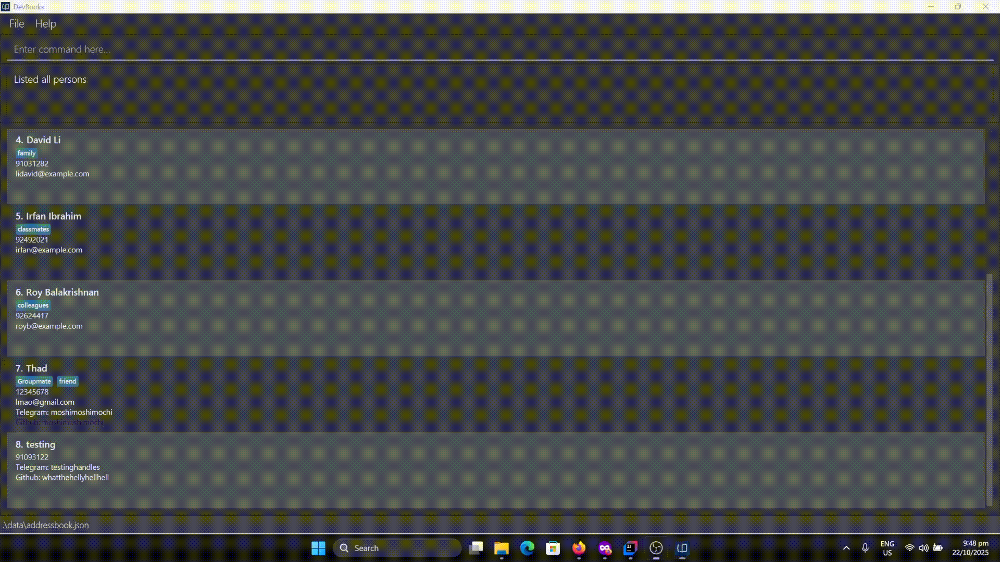
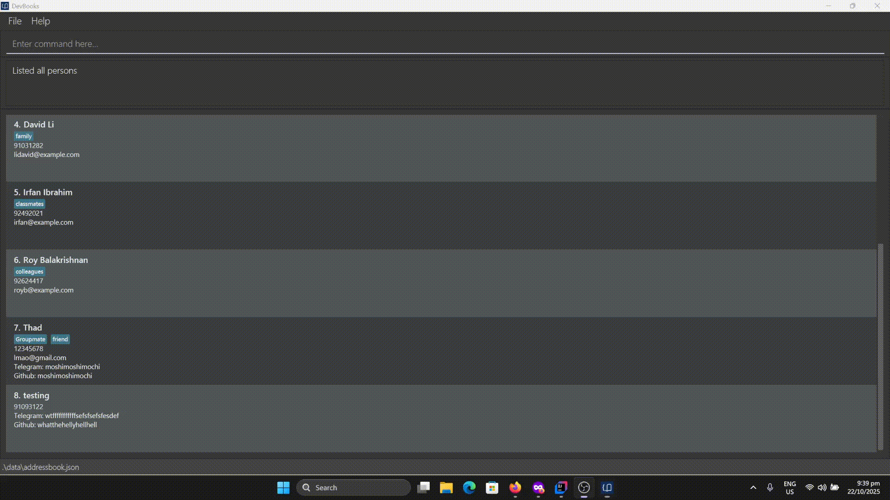

AddressBook Level 3 (AB3) is a **desktop app for managing contacts, optimized for use via a Command Line Interface** (CLI) while still having the benefits of a Graphical User Interface (GUI). If you can type fast, AB3 can get your contact management tasks done faster than traditional GUI apps.

* Table of Contents
{:toc}

--------------------------------------------------------------------------------------------------------------------

## Quick start

1. Ensure you have Java `17` or above installed in your Computer.<br>
   **Mac users:** Ensure you have the precise JDK version prescribed [here](https://se-education.org/guides/tutorials/javaInstallationMac.html).

1. Download the latest `.jar` file from [here](https://github.com/se-edu/addressbook-level3/releases).

1. Copy the file to the folder you want to use as the _home folder_ for your AddressBook.

1. Open a command terminal, `cd` into the folder you put the jar file in, and use the `java -jar addressbook.jar` command to run the application.<br>
   A GUI similar to the below should appear in a few seconds. Note how the app contains some sample data.<br>
   

1. Type the command in the command box and press Enter to execute it. e.g. typing **`help`** and pressing Enter will open the help window.<br>
   Some example commands you can try:

   * `list` : Lists all contacts.

   * `add n/John Doe p/98765432 e/johnd@example.com a/John street, block 123, #01-01` : Adds a contact named `John Doe` to the Address Book.

   * `delete 3` : Deletes the 3rd contact shown in the current list.

   * `clear` : Deletes all contacts.

   * `exit` : Exits the app.

1. Refer to the [Features](#features) below for details of each command.

--------------------------------------------------------------------------------------------------------------------

## Features

<div markdown="block" class="alert alert-info">

**:information_source: Notes about the command format:**<br>

* Words in `UPPER_CASE` are the parameters to be supplied by the user.<br>
  e.g. in `add n/NAME`, `NAME` is a parameter which can be used as `add n/John Doe`.

* Items in square brackets are optional.<br>
  e.g `n/NAME [t/TAG]` can be used as `n/John Doe t/friend` or as `n/John Doe`.

* Items with `…`​ after them can be used multiple times including zero times.<br>
  e.g. `[t/TAG]…​` can be used as ` ` (i.e. 0 times), `t/friend`, `t/friend t/family` etc.

* Parameters can be in any order.<br>
  e.g. if the command specifies `n/NAME p/PHONE_NUMBER`, `p/PHONE_NUMBER n/NAME` is also acceptable.

* Extraneous parameters for commands that do not take in parameters (such as `help`, `list`, `exit` and `clear`) will be ignored.<br>
  e.g. if the command specifies `help 123`, it will be interpreted as `help`.

* If you are using a PDF version of this document, be careful when copying and pasting commands that span multiple lines as space characters surrounding line-breaks may be omitted when copied over to the application.
</div>

### Viewing help : `help`

Shows a message explaining how to access the help page.


Format: `help`


### Adding a person: `add`

Adds a person to the address book.

Format: `add n/NAME p/PHONE_NUMBER e/EMAIL a/ADDRESS [t/TAG]…​`

<div markdown="span" class="alert alert-primary">:bulb: **Tip:**
A person can have any number of tags (including 0)
</div>

Examples:
* `add n/John Doe p/98765432 e/johnd@example.com a/John street, block 123, #01-01`
* `add n/Betsy Crowe t/friend e/betsycrowe@example.com a/Newgate Prison p/1234567 t/criminal`

### Listing all persons : `list`

Shows a list of all persons in the address book.

Format: `list [-a (alphabetical)] [-r (recent)]`

* By default, lists all persons in the address book in the order they were added **(first to last)**.
* Use the optional flag to change the listing order:
   * `-a` lists all persons sorted in **alphabetical order by name**.
   * `-r` lists all persons in the **recent order they were added (last to first)**.
* User cannot combine both flags.

Examples:
* `list` shows all persons in the order they were added.
* `list -a` shows all persons in alphabetical order by name.
* `list -r` shows all persons in the reverse order they were added.
* `list -a -r` error message is displayed.

### Editing a person : `edit`

Edits an existing person in the address book.

Format: `edit INDEX [n/NAME] [p/PHONE] [e/EMAIL] [l/TELEGRAM] [g/GITHUB] [t/TAG]…​  [r/TAG]…​`

* Edits the person at the specified `INDEX`. The index refers to the index number shown in the displayed person list. The index **must be a positive integer** 1, 2, 3, …​
* At least one of the optional fields must be provided.
* Existing values will be updated to the input values.
* When editing tags, you can add or remove tags.
  * To add tags, use the prefix `t/` followed by the tags to be added.
  * To remove tags, use the prefix `r/` followed by the tags to be removed.
    * User will be informed if any of the tags to be removed do not exist on the person.

Examples:
*  `edit 1 p/91234567 e/johndoe@example.com`
   * Edits the phone number and email address of the 1st person to be `91234567` and `johndoe@example.com` respectively.
  *  `edit 2 n/Betsy Crower t/CS2103 t/CS2100 r/CS1101S`
     * Edits the name of the 2nd person to be `Betsy Crower`, adds the tag `CS2103` & `CS2100`, and removes the tag `CS1101S`.
       ```
       Edited Person: Betsy Crower; Phone: 91093122; Telegram: BestyCrower; Github: BestyCrower; Tags: [CS2100][CS2103]
       ```

### Locating persons by name: `find`

Finds persons whose names contain any of the given keywords.

Format: `find KEYWORD [MORE_KEYWORDS]`

* The search is case-insensitive. e.g `hans` will match `Hans`
* The order of the keywords does not matter. e.g. `Hans Bo` will match `Bo Hans`
* Only the name is searched.
* Only full words will be matched e.g. `Han` will not match `Hans`
* Persons matching at least one keyword will be returned (i.e. `OR` search).
  e.g. `Hans Bo` will return `Hans Gruber`, `Bo Yang`

Examples:
* `find John` returns `john` and `John Doe`
* `find alex david` returns `Alex Yeoh`, `David Li`<br>
  

### Deleting a person : `delete`

Deletes the specified person from the address book.

Format: `delete INDEX`

* Deletes the person at the specified `INDEX`.
* The index refers to the index number shown in the displayed person list.
* The index **must be a positive integer** 1, 2, 3, …​

Examples:
* `list` followed by `delete 2` deletes the 2nd person in the address book.
* `find Betsy` followed by `delete 1` deletes the 1st person in the results of the `find` command.

### Clearing all entries : `clear`

Clears all entries from the address book.

Format: `clear`

### Exiting the program : `exit`

Exits the program.

Format: `exit`

### Confirming commands : `y`/`n`

The `delete` and `clear` commands require you to confirm the operation.

If a previous command required a confirmation, a valid confirmation must be supplied before other commands can be run.

Confirm Command Format: `y`

Cancel Command Format: `n`

### Switching Modes
<div markdown="block" class="alert alert-info">

**:information_source: Notes about switching modes:**<br>

* Commands listed in this section are *global* - they don't need to be inserted into the Command Box.

* `<Esc>` refers to the *escape key* on the keyboard.
</div>

#### Insert Mode: `i`

Insert mode is the mode the application starts in. It allows you to send commands in the Command Box.

Enter insert mode by pressing `i`.

#### Entering Scroll mode: `<Esc>`

Scroll mode allows you to navigate entries in the application without leaving the home row. Scroll mode disables
input to the Command Box, but don't worry about forgetting how to go back to input mode - a helpful hint is shown
every time you enter scroll mode.

Enter scroll mode by pressing `<Esc>`

##### Navigating down: `k`

Press `k` to select the entry below the current entry.

##### Navigating up: `l`

Press `l` to select the entry above the current entry.


### Launching external communication modes : `launch`

Launches an external application to communicate with the specified person via the specified mode.

Format: `launch INDEX [-e (Email)] [-t (Telegram)] [-g (GitHub)]`

* The index refers to the index number shown in the displayed person list. The index **must be a positive integer** 1, 2, 3, …​
* Use the flag to specify the communication mode:
    * `-e` launches the default email application to compose an email to the person's email address.
        * Depending on the user's system settings, the email may be composed in an email client or web browser.
    * `-t` launches Telegram web browser that links to opening a chat with the person's Telegram handle.
        * To open the chat through web browser, the user is required to have Telegram application installed on their device.
        * Checking existence of Telegram user is outside the scope of this feature and is handled by Telegram application.
    * `-g` launches web browser that links to the person's GitHub profile.
        * Checking existence of GitHub user is outside the scope of this feature and is handled by GitHub.
* User must specify **exactly one flag**.
* If the person does not have the specified communication mode, an error message is shown.
* User's interaction with the launched application is outside the scope of this feature.
* User's can launch external application through the GUI by left-clicking the email, telegram or github icon of a person in the person card.

Examples:
* `launch 2 -e` launches the default email application to compose an email to the 2nd person in the displayed person list.
* `launch 3 -t` launches Telegram web browser to open a chat with the 3rd person's Telegram handle in the displayed person list.
* `launch 1 -g` launches web browser to the GitHub profile of the 1st person in the displayed person list.
* Launching through CLI 
* Launching through GUI 

### Saving the data

There is no need to save manually as the AddressBook data are saved in the hard disk automatically **ONLY after any command that changes the data**.
* Commands that change the data include: `add`, `edit`, `delete`, and `clear`.
* Commands that do not change the data include: `help`, `list`, `find`, `launch`, and `exit`.

### Editing the data file

AddressBook data are saved automatically as a JSON file `[JAR file location]/data/addressbook.json`. Advanced users are welcome to update data directly by editing that data file.

<div markdown="span" class="alert alert-warning">:exclamation: **Caution:**
If your changes to the data file makes its format invalid, AddressBook will discard all data and start with an empty data file at the next run. Hence, it is recommended to take a backup of the file before editing it.<br>
Furthermore, certain edits can cause the AddressBook to behave in unexpected ways (e.g., if a value entered is outside of the acceptable range). Therefore, edit the data file only if you are confident that you can update it correctly.
</div>

### Autocomplete `[coming in v1.5]`

As you type commands in the Command Box, autocomplete suggestions may be shown. To accept the autocomplete text, press `<Tab>`.

Autocomplete suggestions are shown in-place and in grey.

### Archiving data files `[coming in v2.0]`

_Details coming soon ..._

--------------------------------------------------------------------------------------------------------------------

## FAQ

**Q**: How do I transfer my data to another Computer?<br>
**A**: Install the app in the other computer and overwrite the empty data file it creates with the file that contains the data of your previous AddressBook home folder.

--------------------------------------------------------------------------------------------------------------------

## Known issues

1. **When using multiple screens**, if you move the application to a secondary screen, and later switch to using only the primary screen, the GUI will open off-screen. The remedy is to delete the `preferences.json` file created by the application before running the application again.
2. **If you minimize the Help Window** and then run the `help` command (or use the `Help` menu, or the keyboard shortcut `F1`) again, the original Help Window will remain minimized, and no new Help Window will appear. The remedy is to manually restore the minimized Help Window.

--------------------------------------------------------------------------------------------------------------------

## Command summary

Action | Format, Examples
--------|------------------
**Add** | `add n/NAME p/PHONE_NUMBER e/EMAIL a/ADDRESS [t/TAG]…​` <br> e.g., `add n/James Ho p/22224444 e/jamesho@example.com a/123, Clementi Rd, 1234665 t/friend t/colleague`
**Clear** | `clear`
**Delete** | `delete INDEX`<br> e.g., `delete 3`
**Edit** | `edit INDEX [n/NAME] [p/PHONE_NUMBER] [e/EMAIL] [l/TELEGRAM] [g/GITHUB] [t/TAG]…​ [r/TAG]…​`<br> e.g., `edit 1 p/91234567`
**Find** | `find KEYWORD [MORE_KEYWORDS]`<br> e.g., `find James Jake`
**List** | `list [-a (alphabetical)] [-r (recent)]`<br> e.g., `list -a`
**Help** | `help`
**Launch** | `launch INDEX [-e (Email)] [-t (Telegram)] [-g (GitHub)]`<br> e.g., `launch 2 -e`

--------------------------------------------------------------------------------------------------------------------

## Navigation Summary

Mode | Key Bind
---------|-----------------
**Insert**| **i**
**Scroll**| **Esc**

Scroll Action | Key Bind
--------------|-----------------
**Scroll Up**| **k**
**Scroll Down**| **l**
