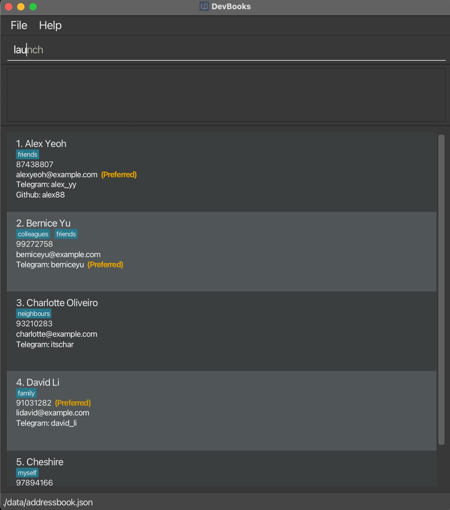
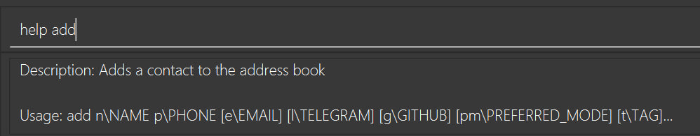
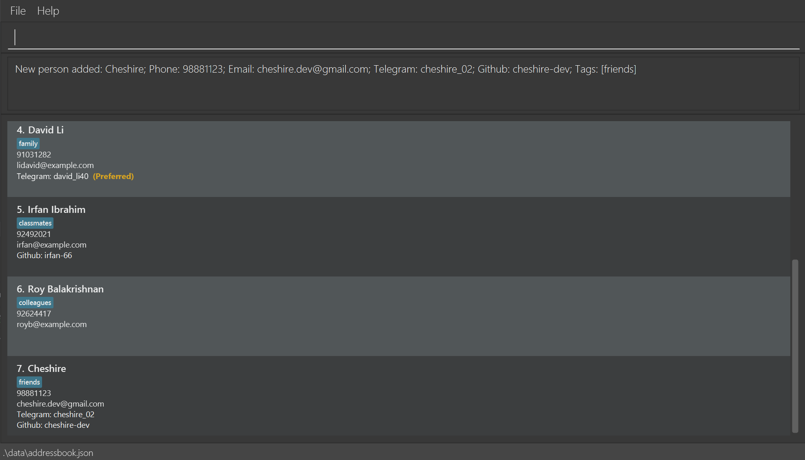
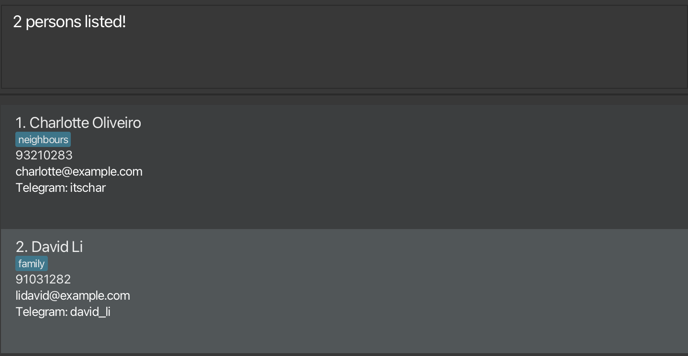
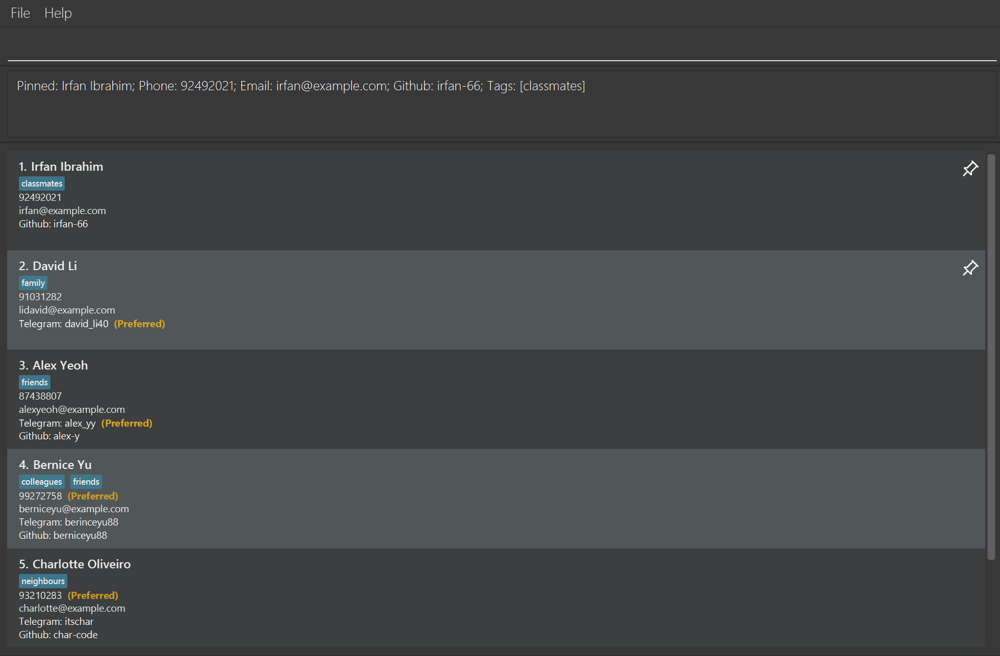
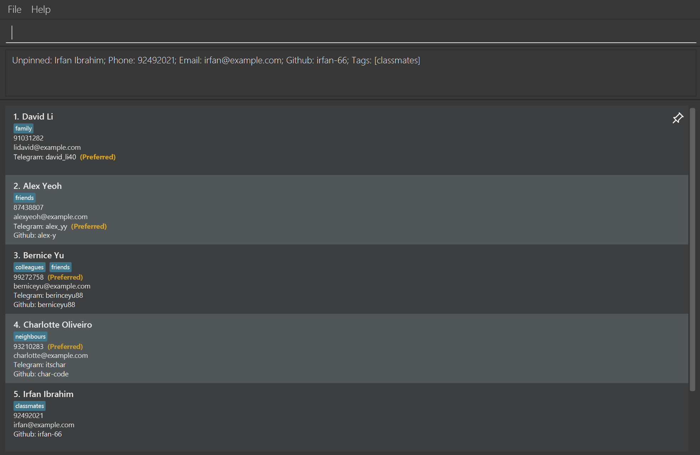
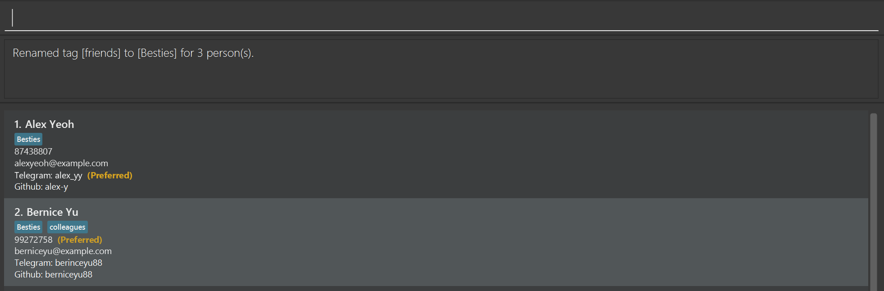
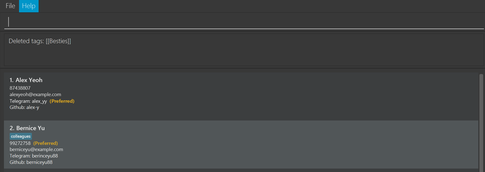

DevBooks is a **desktop app for managing contacts, optimized for use via a Command Line Interface** (CLI) while still having the benefits of a Graphical User Interface (GUI). If you can type fast, DevBooks can get your contact management tasks done faster than traditional GUI apps.

* Table of Contents
{:toc}

--------------------------------------------------------------------------------------------------------------------

## Quick start

1. Ensure you have Java `17` or above installed in your Computer.<br>
   **Mac users:** Ensure you have the precise JDK version prescribed [here](https://se-education.org/guides/tutorials/javaInstallationMac.html).

1. Download the latest `.jar` file from [here](https://github.com/AY2526S1-CS2103-F12-2/tp/releases).

1. Copy the file to the folder you want to use as the _home folder_ for DevBooks.

1. Open a command terminal, `cd` into the folder you put the jar file in, and use the `java -jar devbooks.jar` command to run the application.<br>
   A GUI similar to the below should appear in a few seconds. Note how the app contains some sample data.<br>
   

1. Type the command in the command box and press Enter to execute it. e.g. typing **`help`** and pressing Enter will open the help window.<br>
   Some example commands you can try:

   * `list` : Lists all contacts.

   * `add n\Cheshire Doe p\98112321 e\cheshire@example.com l\cheshire_02 g\cheshire-dev` : Adds a contact named `Cheshire Doe` to the Address Book.

   * `delete 3` : Deletes the 3rd contact shown in the current list.

   * `clear` : Deletes all contacts.

   * `exit` : Exits the app.

1. Refer to the [Features](#features) below for details of each command.

--------------------------------------------------------------------------------------------------------------------

## Features

<div markdown="block" class="alert alert-info">

**:information_source: Notes about the command format:**<br>

* Words in `UPPER_CASE` are the parameters to be supplied by the user.<br>
  e.g. in `add n\NAME`, `NAME` is a parameter which can be used as `add n\John Doe`.

* Items in square brackets are optional.<br>
  e.g `n\NAME [t\TAG]` can be used as `n\John Doe t\friend` or as `n\John Doe`.

* Items with `…`​ after them can be used multiple times including zero times.<br>
  e.g. `[t\TAG]…​` can be used as ` ` (i.e. 0 times), `t\friend`, `t\friend t\family` etc.

* Parameters can be in any order.<br>
  e.g. if the command specifies `n\NAME p\PHONE_NUMBER`, `p\PHONE_NUMBER n\NAME` is also acceptable.

* Extraneous parameters for commands that do not take in parameters (such as `list`, `exit` and `clear`) will be ignored.<br>
  e.g. if the command specifies `list 123`, it will be interpreted as `list`.

* If you are using a PDF version of this document, be careful when copying and pasting commands that span multiple lines as space characters surrounding line-breaks may be omitted when copied over to the application.
</div>

### Viewing help : `help`

Shows help message in the GUI, explaining all commands.


Format: `help`

* Use command name to look up detailed usage



Format: `help add`

### Adding a person: `add`

Adds a person to the address book.

Format: `add n\NAME p\PHONE_NUMBER [e\EMAIL] [l\TELEGRAM] [g\GITHUB] [pm\PREFERRED_MODE] [t\TAG]…​`

<div markdown="span" class="alert alert-primary">:bulb: **Tip:**
A person can have any number of tags (including 0)
</div>

Examples:
* `add n\Alice Chua p\90001231`
* `add n\John s/o Doe p\97449100`
* `add n\John Doe p\98765432 e\johnd@example.com`
* `add n\Cheshire p\98112321 e\cheshire@example.com l\cheshire_02 g\cheshire-dev`
* `add n\Betsy Crowe p\99998888 t\friend e\betsycrowe@example.com  t\criminal l\betsy001 g\betsy12 pm\telegram`



<div markdown="span" class="alert alert-primary">:bulb: **Tip:**
Parameters like Email, Telegram, GitHub, Preferred Contact and Tags are **optional**
</div>

### Listing all persons : `list`

Shows a list of all persons in the address book.

Format: `list [-a (alphabetical)] [-r (recent)]`

* By default, lists all persons in the address book in the order they were added **(first to last)**.
* Use the optional flag to change the listing order:
   * `-a` lists all persons sorted in **alphabetical order by name**.
   * `-r` lists all persons in the **recent order they were added (last to first)**.
* User cannot combine both flags.

Examples:
* `list` shows all persons in the order they were added.
* `list -a` shows all persons in alphabetical order by name.
* `list -r` shows all persons in the reverse order they were added.
* `list -a -r` error message is displayed.

### Editing a person : `edit`

Edits an existing person in the address book.

Format: `edit INDEX [n\NAME] [p\PHONE] [e\EMAIL] [l\TELEGRAM] [g\GITHUB] [pm\PREFERRED_MODE] [t\TAG]…​  [r\TAG]…​`

* Edits the person at the specified `INDEX`. The index refers to the index number shown in the displayed person list. The index **must be a positive integer** 1, 2, 3, …​
* At least one of the optional fields must be provided.
* To clear a field, specify the prefix but leave the value empty.
  * Only `Email`, `Telegram`, `Github`, `Preferred Mode` field can be cleared
* Existing values will be updated to the input values.
* When editing tags, you can add or remove tags.
  * To add tags, use the prefix `t\` followed by the tags to be added.
  * To remove tags, use the prefix `r\` followed by the tags to be removed.
    * User will be informed if any of the tags to be removed do not exist on the person.

Examples:
*  `edit 1 p\91234567 e\johndoe@example.com`
   * Edits the phone number and email address of the 1st person to be `91234567` and `johndoe@example.com` respectively.
  *  `edit 2 n\Betsy Crower t\CS2103 t\CS2100 r\CS1101S l\`
     * Edits the name of the 2nd person to be `Betsy Crower`, adds the tag `CS2103` & `CS2100`, removes the tag
       `CS1101S` and clears the Telegram field.
       ```
       Edited Person: Betsy Crower; Phone: 91093122; Telegram: ; Github: BestyCrower; Tags: [CS2100][CS2103]
       ```

### Finding persons by name or tag: `find`

Finds all contacts whose name or tag has any word starting with any of the given keywords.

Format: `find n\KEYWORD [MORE_KEYWORDS]` or `find t\KEYWORD [MORE_KEYWORDS]`

* Keywords must match the **START** of any word in the name or tag.
  * e.g. `Ha` will match `Hans Zimmer` (first name) and `David Harris` (surname), but not `Johann`.
* The search is **case-insensitive**.
* Only one prefix (`n\` for names or `t\` for tags) can be used at a time. If both are provided, **only the first 
  prefix and its keywords are used.**
* Contacts matching **at least one keyword** will be displayed (i.e. `OR` search).
* The order of keywords does not matter.

Examples:
* `find n\John`
  * Returns persons whose names contain any word starting with `John`, such as `johnny Tan` and `Mary Johnson`.
* `find t\friend`
  * Returns all contacts tagged with `friend`.
* `find n\alex t\friend`
  * Searches by name only (`n\alex`), ignores the second prefix.
* `find t\friend n\alex`
  * Searches by tag only (`t\friend`), ignores the second prefix.
* `find n\a`
  * Finds all persons with names start with "A" e.g. `Alex yeoh`, `amy tan`
* `find n\charlotte david`
  * Finds anyone whose **name has words starting with** `Charlotte` or `David`. (e.g.`Charlotte 
    Oliveiro`, `David Li`<br>
    

### Deleting a person : `delete`

Deletes the specified person from the address book. Command requires follow-up confirmation.

Format: `delete INDEX`

* Deletes the person at the specified `INDEX`.
* The index refers to the index number shown in the displayed person list.
* The index **must be a positive integer** 1, 2, 3, …​

Examples:
* `list` followed by `delete 2` and a `y` deletes the 2nd person in the address book.
* * `list` followed by `delete 2` and a `n` performs no operation.
* `find n\Betsy` followed by `delete 1` and a `y` deletes the 1st person in the results of the `find` command.

### Pinning a person : `pin`

Pins the specified person to the top of the address book.

Format: `pin INDEX`

* Pins the person at the specified `INDEX`.
* The index refers to the index number shown in the displayed person list.
* The index **must be a positive integer** 1, 2, 3, …​

Examples:
* `list` followed by `pin 4` pins the 4th person in the address book to the top.
* `find n\Betsy` followed by `pin 2` pins the 2nd person in the results of the `find` command.



### Unpinning a person : `unpin`

Unpins the specified person from the address book.

Format: `unpin INDEX`

* Unpins the person at the specified `INDEX`.
* The index refers to the index number shown in the displayed person list.
* The index **must be a positive integer** 1, 2, 3, …​

Examples:
* `list` followed by `unpin 1` unpins the 1st person and removes them from the pinned list at the top.
* `find n\Betsy` followed by `unpin 2` unpins the 2nd person in the results of the `find` command.



### Clearing all entries : `clear`

Clears all entries from the address book. Command requires a follow-up confirmation.

Format: `clear`

### Exiting the program : `exit`

Exits the program.

Format: `exit`

### Confirming commands : `y`/`n`/`yes`/`no`

The `delete` and `clear` commands require you to confirm the operation.

If a previous command required a confirmation, a valid confirmation must be supplied before other commands can be run.

Confirm Command Format: `y` or `yes`

Cancel Command Format: `n` or `no`

<div markdown="block" class="alert alert-info">
These above confirmation inputs are case *insensitive*
</div>

### Switching Modes
<div markdown="block" class="alert alert-info">

**:information_source: Notes about switching modes:**<br>

* Commands listed in the "Switching Modes" section are *global* - they don't need to be inserted into the Command Box.

* `<Esc>` refers to the *escape key* on the keyboard.

* Switching to scroll mode *does not clear pending state* - if you have a pending operation (e.g. deletion), you must confirm the operation upon switching back to insert mode.  
</div>

#### Insert Mode: `i`

Insert mode is the mode the application starts in. It allows you to send commands in the Command Box.

Switch back to insert mode by pressing `i`.

#### Entering Scroll mode: `<Esc>`

Scroll mode allows you to navigate entries in the application without leaving the home row. Scroll mode disables
input to the Command Box, but don't worry about forgetting how to go back to insert mode - a helpful hint is shown
every time you enter scroll mode.

Enter scroll mode by pressing `<Esc>`

##### Navigating down: `j`

Press `j` to select the entry below the current entry.

##### Navigating up: `k`

Press `k` to select the entry above the current entry.


### Launching external communication modes : `launch`

Launches a browser to communicate with the specified person via the specified mode.

Scope: launching the browser with the correct link specified below.

Format: `launch INDEX [-l (Telegram) | -g (GitHub)]`

* The index refers to the index number shown in the displayed person list. The index **must be a positive integer** 1, 2, 3, …​
* Use the flag to specify the communication mode:
    * `-l` launches browser with the formatted link `https://t.me/HANDLE`, whereby handle should be the specified contact's Telegram handle,
        * Do note, to open the chat through web browser, the user is required to have Telegram application installed on their device. (i.e. send button does not allow redirecting Telegram web)
          * However, the ability to check with is also beyond the scope of this feature.
        * Additionally, checking existence of Telegram user is outside the scope of this feature and is handled by Telegram application.
    * `-g` launches browser with the formatted link `https://github.com/USERNAME`, whereby username should be the specified contact's GitHub username,
        * Checking existence of GitHub user is outside the scope of this feature and is handled by GitHub.
* User must specify **exactly one flag**.
* If the person does not have the specified communication mode, an error message is shown.
* User's interaction with the launched application is outside the scope of this feature.
* User's can also launch external application through the GUI by left-clicking the Telegram or GitHub links of a person in the person card.


Examples:
* `launch 3 -l` launches browser with the formatted link `https://t.me/HANDLE`, with `HANDLE` as the  Telegram handle of the 3rd person's in the displayed person list (given they have a Telegram Handle).
* `launch 1 -g` launches browser with the formatted link `https://github.com/USERNAME`, with the `USERNAME` as the GitHub username of the 1st person in the displayed person list (given they have a GitHub username).

**Important Notes:**
* The launch command has only been tested on the following operating systems.
    * Windows
    * MAC
    * LINUX (ARCH)
    * LINUX (FEDORA)
* Your mileage with this feature might vary if your operating system is not one stated above.
* Kindly refer to [Known Issues: 2](#known-issues) to see more about the limitations

### Saving the data

There is no need to save manually as the AddressBook data are saved in the hard disk automatically **ONLY after any command that changes the data**.
* Commands that change the data include: `add`, `edit`, `delete`, `pin`, `unpin`, `tag` and `clear`.
* Commands that do not change the data include: `help`, `list`, `find`, `launch`, and `exit`.

### Editing the data file

AddressBook data are saved automatically as a JSON file `[JAR file location]/data/addressbook.json`. Advanced users are welcome to update data directly by editing that data file.

<div markdown="span" class="alert alert-warning">:exclamation: **Caution:**
If your changes to the data file makes its format invalid, AddressBook will discard all data and start with an empty data file at the next run. Hence, it is recommended to take a backup of the file before editing it.<br>
Furthermore, certain edits can cause the AddressBook to behave in unexpected ways (e.g., if a value entered is outside of the acceptable range). Therefore, edit the data file only if you are confident that you can update it correctly.
</div>

### Accessing Command History
Access your previously entered commands by pressing the `Up` and `Down` arrow keys when the Command Box is focused.
Command history is saved and loaded every time.

<div markdown="block" class="alert alert-info">
Up to 15 of the latest valid commands are saved and preserved in the command history.
</div>

#### Previous Command: `Up` Arrow Key

Press the `Up` arrow key to cycle backwards through your command history.

#### Next Command: `Down` Arrow Key

Press the `Down` arrow key to cycle forwards through your command history.

### Autocomplete

As you type commands in the Command Box, autocomplete suggestions may be shown. To accept the autocomplete text, press `<Tab>`.

Autocomplete suggestions are shown in-place and in grey.

### Updating Tags for Multiple Contacts

Enables ability to rename/delete tags detail for all users that contains the specified tag within the currently displayed list.

#### Renaming Tags for Multiple Contacts

Format: `tag -r t\TAG r\TAG`

* Use `-r` flag to signify a rename tag command
* `t\TAG` refers to the value of the target tag to be renamed
* `r\TAG` refers to the renamed value

Example:
- `tag -r t\CS1101 r\CS2103`
  - renames the existing tag `CS1101` for all contacts that has it with the new tag `CS2103`
  - Expected Output: (Assuming there are 2 people with this tag in the list)
    ```
    Renamed tag [CS1101] to [CS2103] for 2 person(s).
    ```
  - Expected Output: (Assuming no contact has the `CS1101` tag)
    ```
    No persons found with tag: [[CS1101]]
    ```


### Deleting Tags for Multiple Contacts

Format: `tag -d t\TAG…​`

* Use `-d` to signify delete tag command
* `t\TAG` refers to the target tag to be deleted for all users

Example:
- `tag -d t\CS1101 t\CS2103`
    - deletes `CS1101` & `CS2103` tag for all contacts with the tag.
    - Expected Output: (Assuming there are 2 people with this tag in the list)
      ```
      Deleted tags: [[CS1101], [CS2103]]
      ```
    - Expected Output: (Assuming no contact has both the `CS1101` & `CS2103` tag)
      ```
      No persons found with tag: [[CS1101], [CS2103]]
      ```
    - Expected Output: (Assuming no contact has the `CS2103` tag but there are contacts with `CS1101` tag)
      ```
      Deleted tags: [[CS1101]]
      Warning: No persons found with tag: [[CS2103]]. No operation performed on these tags.
      ```



### Exporting Contacts

Exports contacts into a csv file in the data folder.

Format: `export NAME`

* `NAME` refers to the name of the file
* `NAME` is **optional**. Default file name is contacts.csv
* Naming convention and rules follow default filename rules, including illegal characters

Example:

* `export`
    * data will be exported to a file called contacts.csv in data folder
* `export phonebook`
    * data will be exported to a file called phonebook.csv in data folder

--------------------------------------------------------------------------------------------------------------------

## FAQ

**Q**: How do I transfer my data to another Computer?<br>
**A**: Install the app in the other computer and overwrite the empty data file it creates with the file that contains the data of your previous AddressBook home folder.

--------------------------------------------------------------------------------------------------------------------

## Known issues

1. **When using multiple screens**, if you move the application to a secondary screen, and later switch to using only the primary screen, the GUI will open off-screen. The remedy is to delete the `preferences.json` file created by the application before running the application again.
2. **If you are not using one of listed Operating System(OS)**, then `launch` command may not work as expected. Whilst our implementation attempts to use system-specific command to launch the application first, its fallback mechanism uses the java.awt.Desktop api **IF AVAILABLE**. However, linux support with the java.awt libraries is already tenuous at best as it provides inconsistent behaviour between the different distros. Hence, kindly note that if your OS is not one stated in the list, the launch function may function inconsistently.
3. **Unaccounted changes in the AddressBook if its addressbook.json file is edited whilst the application is running.** This is mainly as a result of how we handle when the reading and [saving of data](#saving-the-data) is triggered. As a result we are unable to detect changes to the addressbook.json file during the run time of the application and any direct changes made to this file whilst the application is running will be **OVERWRITTEN if [saving of data](#saving-the-data) is triggered.** Hence, the user should **NOT** edit the addressbook.json file while the application is in use.

--------------------------------------------------------------------------------------------------------------------

## Command summary

Action | Format, Examples
--------|------------------
**Add** | `add n\NAME p\PHONE_NUMBER [e\EMAIL] [l\TELEGRAM] [g\GITHUB] [pm\PREFERRED_MODE] [t\TAG]…​` <br> e.g., `add n\James Ho p\22224444 e\jamesho@example.com l\james_ho23 g\james-dev10 pm\telegram t\friend t\colleague`
**Clear** | `clear`
**Delete** | `delete INDEX`<br> e.g., `delete 3`
**Edit** | `edit INDEX [n\NAME] [p\PHONE_NUMBER] [e\EMAIL] [l\TELEGRAM] [g\GITHUB] [pm\PREFERRED_MODE] [t\TAG]…​ [r\TAG]…​`<br> e.g., `edit 1 p\91234567`
**Find** | `find n\KEYWORD [MORE_KEYWORDS]` or `find t\KEYWORD [MORE_KEYWORDS]`<br> e.g., `find n\James Jake`, `find t\friend`
**List** | `list [-a (alphabetical)] [-r (recent)]`<br> e.g., `list -a`
**Help** | `help COMMAND`
**Launch** | `launch INDEX [-l (Telegram)] [-g (GitHub)]`<br> e.g., `launch 2 -l`
**Tag** | Rename: `tag -r t\TAG r\TAG` <br> `tag -r t\CS1101 r\CS2103` <br><br> Delete: `tag -d t\TAG…` <br> `tag -d t\CS1101`
**Pin** | `pin INDEX` <br> e.g., `pin 3`
**Unpin** | `unpin INDEX` <br> e.g., `unpin 1`
**Export** | `export [NAME]` <br> e.g., `export phonebook`

--------------------------------------------------------------------------------------------------------------------

## Navigation Summary

Mode | Key Bind
---------|-----------------
**Insert**| **i**
**Scroll**| **Esc**

Scroll Action | Key Bind
--------------|-----------------
**Scroll Up**| **k** or **arrow up key**
**Scroll Down**| **j** or **arrow down key**
